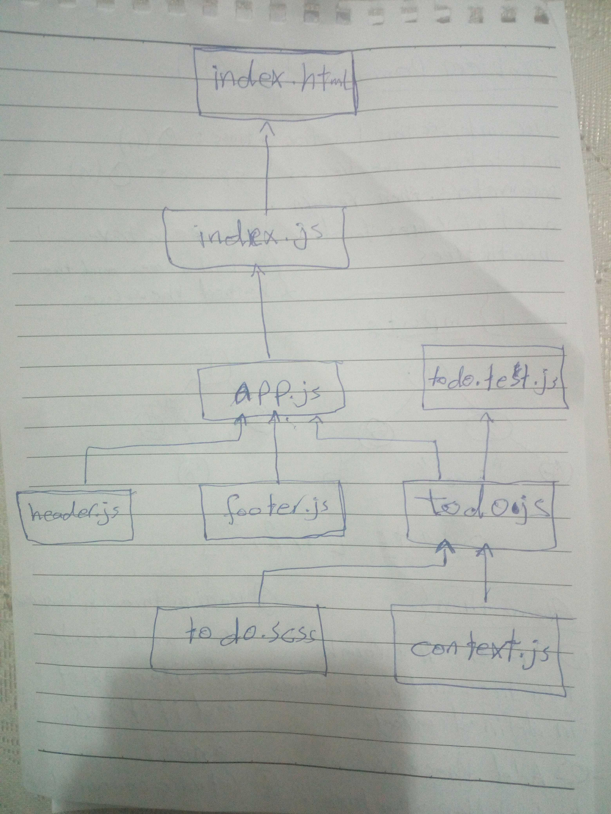

# LAB - Class 34

### Author: Qusai-Alhanaktah

### Links and Resources

- [submission PR](https://github.com/401-advanced-javascript-qusaiAlhanaktah/lab-34/pull/1)
- [ci/cd](https://github.com/401-advanced-javascript-qusaiAlhanaktah/lab-34/actions) (GitHub Actions)

### Setup
npm i react enzyme gh-pages node-sass

#### How to initialize/run your application (where applicable)

- `npm run test`
- `npm run start`

#### Tests

- How do you run tests?
     - 'npm test'
- Any tests of note?
     - jest --verbose --coverage
- Describe any tests that you did not complete, skipped, etc
     - evey test solved and another time i will cover more cases.

### [Deployment Link in netlify](https://competent-engelbart-02d7d2.netlify.com/)

### Group Member :
1- Qusay Hanaqtah.
2- Ayman Alkhawaldeh.
3- Mohammad Hawamdeh.

#### UML
Link to an image of the UML for your application and response to events

